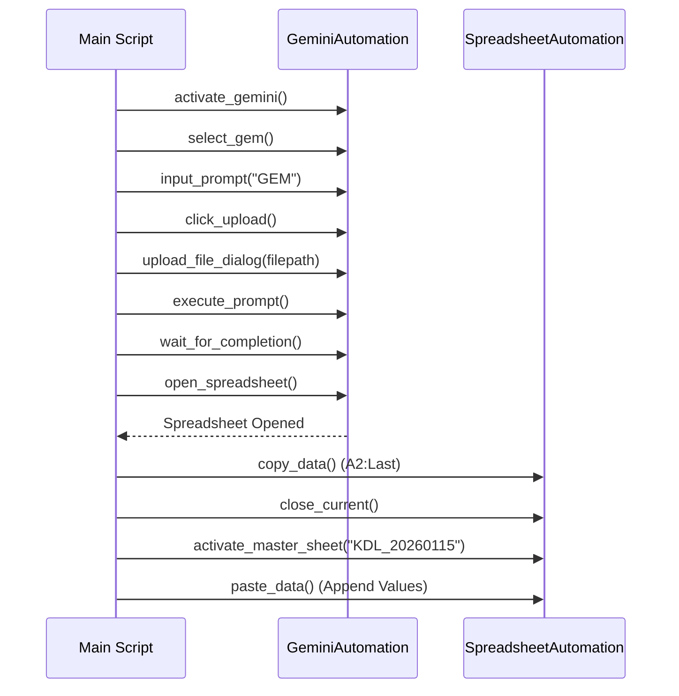

# 詳細設計書: Gemini 自動化モジュール (Gemini Ops)

ソースコード `gemini_ops.py` の実装に基づく詳細設計仕様書です。

## 1. 概要
本モジュールは、Google Gemini の Web インターフェースおよび Google スプレッドシートの操作を自動化するための機能を提供します。画像認識 (`pyautogui` 経由) と UI Automation (`pywinauto`) を組み合わせ、ロバストな操作を実現しています。

## 2. モジュール構成
- **ファイル名**: `gemini_ops.py`
- **主な依存ライブラリ**: `pyautogui`, `pywinauto`, `os`, `time`
- **内部依存**: `config`, `ui_helpers`

## 3. クラス設計

### 3.1 クラス: `GeminiAutomation`
Gemini Web UI に対する一連の操作を管理します。各操作には、画像認識による UI 操作と、失敗時のキーボード操作などのフォールバック機構が実装されています。

#### メソッド一覧

| メソッド名 | 概要 | 実装ロジック |
| :--- | :--- | :--- |
| `__init__` | 初期化 | `RetryHandler` インスタンスを初期化し、リトライ制御を準備する。 |
| `find_gemini_window` | ウィンドウ検索 | `pywinauto` を使用し、タイトルに `GEMINI_WINDOW_TITLE` (config定義) を含むウィンドウを検索して返す。 |
| `activate_gemini` | Gemini アクティブ化 | `find_gemini_window` で取得したウィンドウに対し `set_focus()` を実行。失敗時はリトライを行う。 |
| `select_gem` | Gem 選択 | 優先: `gem_button.png` 画像認識クリック。 フォールバック: キーボード操作 (実装予定/汎用待機)。 |
| `input_prompt` | プロンプト入力 | `pyautogui.typewrite` を使用して文字列 (デフォルト: "GEM") を入力する。 |
| `click_upload` | アップロードボタン押下 | 優先: `upload_button.png` 画像認識クリック。 フォールバック: 汎用クリック処理 (実装予定)。 |
| `upload_file_dialog` | ファイル選択処理 | ファイルアップロードダイアログ制御。 1. ダイアログ待機 2. Windowsパス形式への置換 3. パス文字列の入力と Enter 押下 |
| `execute_prompt` | プロンプト実行 | 優先: `send_button.png` 画像認識クリック。 フォールバック: `Enter` キー押下。 |
| `wait_for_completion` | 完了待機 | `spreadsheet_button.png` が画面に出現するのを待機 (生成完了の合図)。 タイムアウト時は固定時間待機に切り替え。 |
| `open_spreadsheet` | スプレッドシート展開 | 生成結果の「スプレッドシートで開く」ボタンをクリック。 優先: 画像認識 (`wait_and_click_image`)。 フォールバック: `Enter` キー (フォーカスがあると仮定)。 |
| `confirm_spreadsheet_dialog` | ダイアログ確認 | スプレッドシート作成確認ダイアログが出た場合の `Enter` 押下による承認処理。 |

### 3.2 クラス: `SpreadsheetAutomation`
ブラウザで開かれたスプレッドシートおよび集約用マスターシートの操作を行います。

#### メソッド一覧

| メソッド名 | 概要 | 実装ロジック |
| :--- | :--- | :--- |
| `find_spreadsheet_window` | ウィンドウ検索 | 指定されたタイトルパターンを含むウィンドウを `pywinauto` で検索。 |
| `copy_data` | データコピー | 現在開いているシートのデータをコピー。 1. `Ctrl+Home` (先頭へ) 2. `Down` (ヘッダー回避) 3. `Ctrl+Shift+End` (全範囲選択) 4. `Ctrl+C` (コピー) |
| `activate_master_sheet` | マスターシート切替 | 引数で指定された名称 (例: `KDL_20260115`) のウィンドウを検索しアクティブ化。 |
| `paste_data` | データ貼り付け | マスターシートの末尾に追記。 1. `Ctrl+End` (最終行へ) 2. `Down` (次の行へ) 3. `Home` (A列へ) 4. `Ctrl+Shift+V` (値貼り付け) |
| `close_current` | 現在閉じる | `Ctrl+W` を送信して現在のアクティブタブ/ウィンドウを閉じる。 |

## 4. 処理フロー

## 5. UI ヘルパーと設定
コード内の `ui_helpers` および `config` モジュールへの参照から、以下の機能が外部化されていることが確認できます。

- **画像認識**: `find_image_on_screen`, `click_image`, `wait_for_image` により、OpenCVベースのテンプレートマッチングを利用。
- **リトライ制御**: `RetryHandler` クラスにより、不安定なUI操作に対する再試行ロジックを一元管理。
- **待機設定**: `WAIT_SHORT`, `WAIT_MEDIUM` 等の定数により、アクション間のタイミングを調整可能。

## 6. 特記事項
- **ハイブリッド方式**: `pywinauto` による確実なウィンドウ制御と、`pyautogui` による柔軟な画像認識・入力操作を併用している点が特徴。
- **ロバスト性**: 画像認識失敗時にキーボードショートカット等のフォールバック手段が実装されており、自動化の停止を防ぐ設計となっている。
